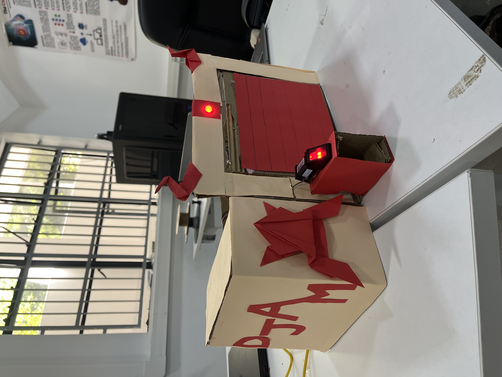

# Projet-garage-automatique

## Description
Ce projet, développé en C++ avec l'Arduino IDE, permet de contrôler automatiquement une porte de garage à l’aide d’un capteur d’empreinte digitale et de capteur infrarouge pour plus de sécurité. Il vise à simplifier la gestion des entrées et sorties de véhicules tout en assurant une authentification sécurisée.

<p align="center">
  
</p>

## Composants
- Arduino Uno
- Infrared Reflection Sensor Module (IR Sensor)
- Optical Fingerprint Sensor (Grove Fingerprint Sensor)
- Standard Servo Motor
- Ultrasonic Distance Sensor (HC-SR04)
- LED RGB

## Fonctionnalités
- Gestion des entrées et des sorties des véhicules
- Capteur d'empreinte digitale
- Utilisation d'un infrarouge pour détécter la présence d'un objet au seuil de la porte

## Installation
1. Clonez le dépôt :
   
   ```bash
   git clone https://github.com/Math-Baba/Projet-garage-automatique.git
   ```
2.Ouvrez le fichier .ino dans l’IDE Arduino.

3.Ajoutez les bibliothèques nécessaires dans l’IDE :
```bash
Adafruit_Fingerprint
Servo
NewPing.h
SoftwareSerial.h
```
4.Connectez votre Arduino et téléversez le code.
   

## Auteur
- **Math-Baba** - [GitHub](https://github.com/Math-Baba)
- **amy-andriamalala** - [Github](https://github.com/amy-andriamalala)


